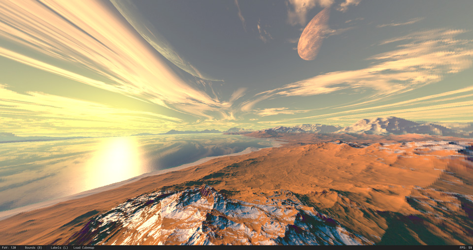

	

Cubemap Inspector is a small application designed to be used to check cubemaps you have made or just looking at cubemaps others have made.

## Feature List
- Viewable bounds.
- Loading each side individually.
- Zoomable freelook camera.
- Basic recognition of mass loading entire cubemap sides.

## Screenshots

## Controls
- **Right Mouse Button** - Hold for free look.
- **L** - Toggle labels on and off (can also be toggled via status bar).
- **B** - Toggle bounds on a off (can also be toggled via status bar).
- **Mouse Scroll** - Zoom in and out. FoV views in status bar on the bottom left.

## TODO
- [ ] Ability to load in Parabolics/Double Parabolics/Other formats.
- [ ] Drag and drop onto EXE to view cubemap without having to use the Open dialog.
- [ ] Save the last path the user loaded in.
- [ ] Auto turn table.
- [ ] Togglable SFX like flaring/ghosting.
- [ ] Editable recognition of file names for mass loading of sides.

## Extra
If you don't have any cubemaps or are not into making your own but are still curious about the software you can download some pretty cool cubemaps here: http://www.custommapmakers.org/skyboxes.php.
